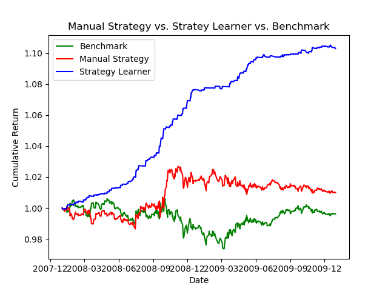

# ML-for-Trading-Compare Methods

 I compared my Manual Strategy, Strategy Learner, and the benchmark from project 6. For each case, I used the JPM symbol with a start date of January 1st, 2008 and an end date of December 31st 2009. Each learner was first trained then tested with over this same in-sample time frame. The starting cash value in each case was $100,000.
As you can see in the graph below, while the Manual Strategy did outperform the benchmark, the Strategy Learner blew both of its competitors out of the water, showing a clear upward trend throughout the entirety of the sample period. The benchmark actually loses value, coming in at a 0.99 cumulative return. The manual strategy barely manages to return a profit with a 1.01 return. The strategy learner, however, emerges as the clear winner, with a final cumulative return of 1.10.

 
 Given in-sample data, I would expect Strategy Learner to win more often than not and to produce results similar to that as shown above. However, the market can be unpredictable, and it is possible my chosen metrics will one day be thrown out the window, and a slice of in-sample data results in a confusing correlation between my metrics and the rewards function, resulting in strategy learner paling in comparison to the manual or benchmark trades. To guard strategy learner from this possibility, as a hedge fund manager, I would use multiple, time-trusted metrics to decide my trades.
